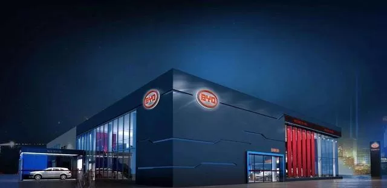

> 

<!--more-->

---

## 产业发展重点之汽车制造业 ##

围绕粤港澳大湾区传统汽车、新能源汽车、智能网联汽车产业的发展需求，对汽车零部件关键领域加大精准招商引资力度，推进新型零部件技术突破和产业化应用，重点培育发展汽车零部件、新能源汽车电池和汽车电子产品三大领域。

一、参考深圳比亚迪汽车的“深圳模式”：为推广电动车，比亚迪另辟蹊径开拓出“公交电动化”这一全新模式，并在改革开放的排头兵深圳率先推进。交电动化这一“深圳模式”主要具有三个优势：一是省，帮助出租车公司和公交公司节省大额燃油费用;二是绿，有助于城市的绿色环保;三是新，深圳模式不是零星的少量电动车投放，而是一整套创新的城市交通绿色解决方案，最大限度的快速实现绿色交通。因此该模式不论对于公交公司还是政府都有极大的吸引力，可快速有效的打开电动车集团采购和政府采购市场。

二、参考百度的无人驾驶：百度Apollo无人驾驶Robotaxi将正式开启常态化商业运营，向公众全面开放。这也是中国首批常态化商业运营的“共享无人车”。

自2021年5月2日起，公众可通过百度Apollo GO App在线约车，即可在北京首钢园等区域，体验自动驾驶出行平台Apollo GO提供的“共享无人车”出行服务。此外，百度专门设置了步行VR导航、遥控车辆鸣笛确认等功能，方便乘客寻找车辆。

百度在自动驾驶领域并非没有竞争者，作为全新的领域，会有许多有实力的厂商进行角逐，其中就包括百度华为的互联网公司，他们的优势在于拥有很强的芯片制造能力，在自动驾驶方面会比传统汽车企业更有优势。但这些互联网大厂的主营业务和汽车有着天差地别，所以他们更多的是通过算法和软件来进行角逐。还有就是类似滴滴美团的服务运营商，他们并不是芯片开发商，也不是汽车制造商，但自动驾驶对于他们而言重要程度不言而喻，一旦自动驾驶成功落地，那么对于滴滴美团这样的企业将会造成很大冲击。

## 小结 ##

基于上述两点，若河源市产业参考上述比亚迪和百度的做法，可以产业一些相关的就业机会，如：

根据新能源汽车制造行业发展特点，结合循环经济画布，可以分析得出，将对河源市的新能源车的产业园有一个推动发展的作用，相关的汽车设计、自动驾驶算法、汽车体验、用户研究等等的就业岗位就会应运而生。
